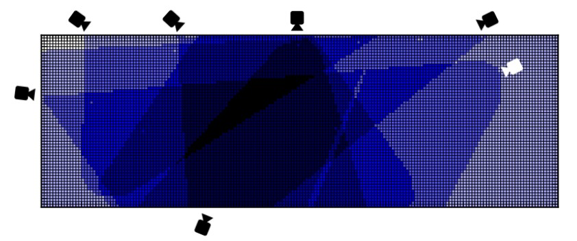
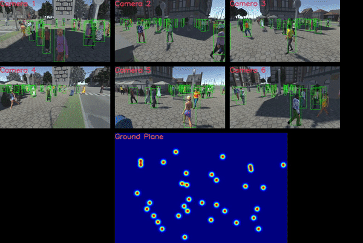
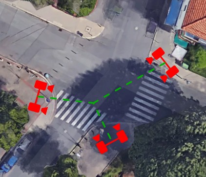
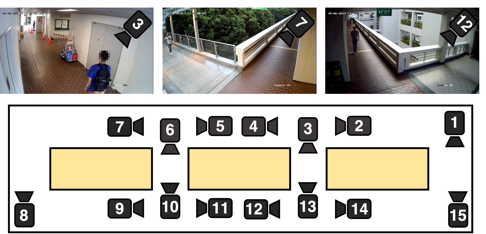
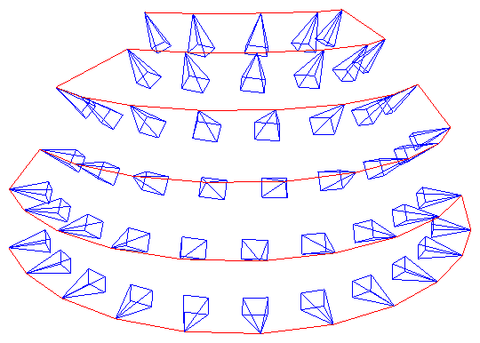
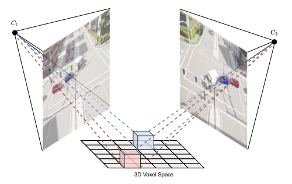
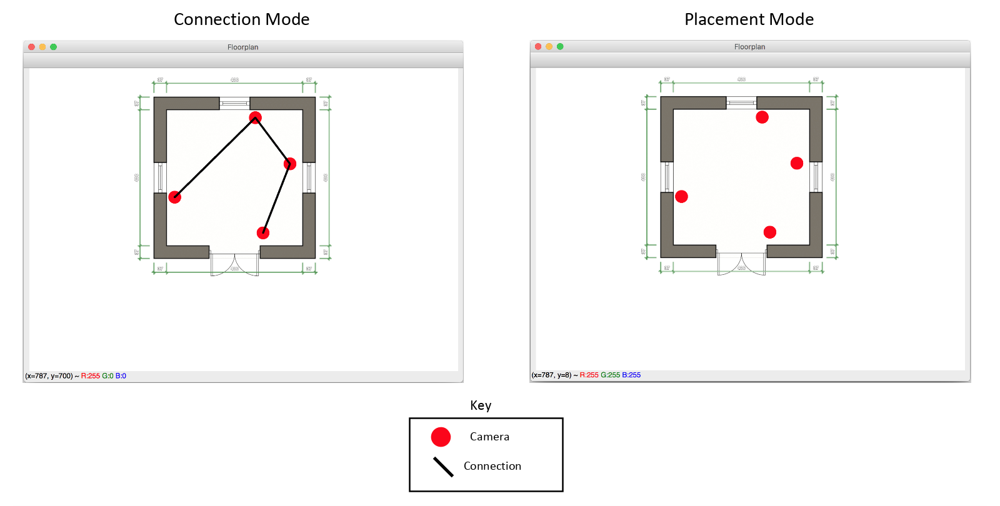
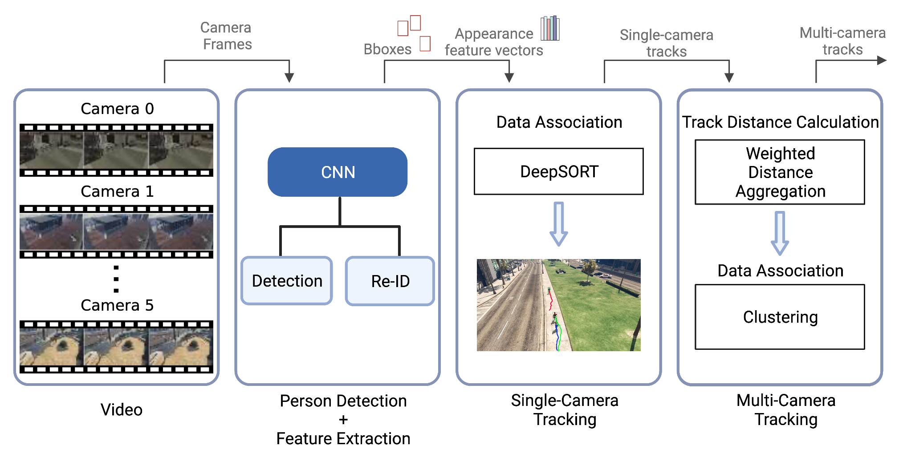
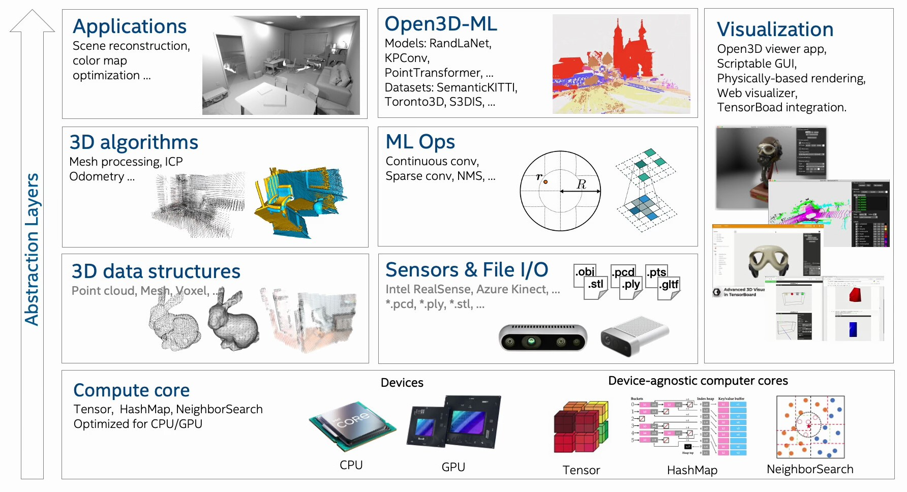
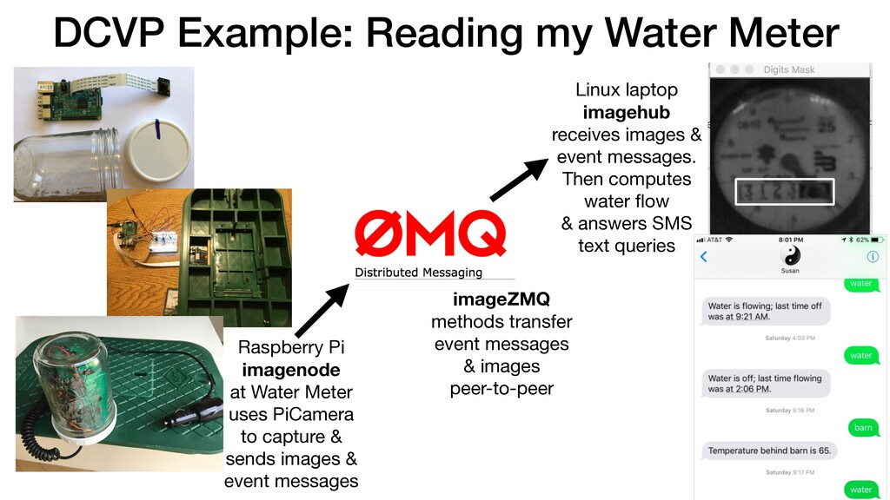

  <picture>
    <source 
        media="(prefers-color-scheme: dark)" 
        srcset="./assets/logo.png">
    
  </picture>

# Chikamera

## 📝 Abstract

**Chikamera** is a *word-play* of:
- 千 (chi) meaning **thousand**, 
- 智 (chi) meaning **wisdom, intellect**, or 
- 散 (chi) meaning **scatter** 

combined with:
- 佳 (ka) meaning **good, fine**, or 
- 花 (ka) meaning **flower**.

Refering to the field of *computer vision*, **chikamera** means *thousands* of *scattered* and *intelligent* **cameras**, which provides *beautiful* *flowers* as **insights**.

## 🧬 Fundamentals

- Camera:

    - [Camera Conventions](https://camtools.readthedocs.io/en/stable/camera.html)

    - Camera Projections - [Extrinsic](https://ksimek.github.io/2012/08/22/extrinsic/) and [Intrinsic](https://ksimek.github.io/2013/08/13/intrinsic/)

    - [Camera FoV](https://commonlands.com/pages/camera-field-of-view-calculator)

- [Video Analytics](https://facit.ai/insights/video-analytics-guide) by [Facit.AI](https://facit.ai)

    - [Smart Count](https://facit.ai/video-analytics-software/smart-count)

    - [Smart Queue](https://facit.ai/video-analytics-software/smart-queue)

    - [Smart Zone](https://facit.ai/video-analytics-software/smart-zone)

    - [Trolley Analytics](https://facit.ai/video-analytics-software/smart-count/trolley-analytics)

## 🛢️ Datasets

- **Wildtrack**: Multi-Camera Person Dataset ([dataset](https://www.kaggle.com/datasets/aryashah2k/large-scale-multicamera-detection-dataset) | [repo](https://github.com/dataset-ninja/wildtrack) | [Toolkit](https://github.com/Chavdarova/WILDTRACK-toolkit) | [Leaderboard](https://paperswithcode.com/sota/multi-object-tracking-on-wildtrack))

- **MultiviewX**: Multi-View Synthetic Pedestrian Detection ([dataset](https://1drv.ms/u/s!AtzsQybTubHfhYZ9Ghhahbp20OX9kA?e=Hm9Xdg) | [Toolkit](https://github.com/hou-yz/MultiviewX) | [Leaderboard](https://paperswithcode.com/sota/multiview-detection-on-multiviewx))

- i.c.sens Multi-View Pedestrian-Tracking Dataset ([dataset](https://service.tib.eu/ldmservice/vdataset/luh-multi-view-pedestrian-tracking))

- **CroHD**: Crowd of Heads Dataset ([dataset](https://www.crowdhuman.org/download.html) | [Leaderboard](https://paperswithcode.com/sota/multiple-object-tracking-on-crohd))

Click for More

- Multi-Camera Trajectory Forecasting ([paper](https://arxiv.org/abs/2005.00282) | [repo](https://github.com/olly-styles/Multi-Camera-Trajectory-Forecasting))

- Multi-camera Multiple-People Tracking ([project](https://iccv2021-mmp.github.io/subpage/dataset.html) | [repo](https://github.com/damo-cv/MMP_Track1_ICCV21))

- EPFL-RLC Multi-Camera Dataset ([project](https://www.epfl.ch/labs/cvlab/data/data-rlc/))

- (Game 3D) MTA Multi Camera Track Auto ([repo](https://github.com/schuar-iosb/mta-dataset))

## 🦾 Features 🦿

✅ **Camera-Mesh Allocation**: Multi-Camera Allocation with Overlapped Field-of-View

⬜ **Camera Calibration**: Camera Self-Location in a Multi-Camera Mesh-System

⬜ **Camera Projection**: Camera (Local) Pixel to Mesh (Global) Coordinate

✅ **Multi-Target Tracking**:
  
  - ✅ Person Re-Identification ([paper](https://arxiv.org/pdf/1905.00953) - [repo](https://github.com/KaiyangZhou/deep-person-reid) - [model zoo](https://kaiyangzhou.github.io/deep-person-reid/MODEL_ZOO.html))

  - ✅ Occluded-Person Re-Identification ([paper](https://arxiv.org/abs/2407.18112) - [repo](https://github.com/VlSomers/keypoint_promptable_reidentification) - [model zoo](https://drive.google.com/drive/folders/1t4wXc2c3qlFaqUCifAlc_OPrFwvb7peD))

⬜ **Multi-Camera Target Association**

⬜ **Grouping Analysis** (individual / pair / group) using:

  - ⬜ **Spatial Proximity** : distance between individuals

  - ⬜ **Trajectory Similarity** : similarity in movement paths or in a coordinated manner (*speed* and *direction*)

  - ⬜ **Temporal Consistency** : time thresholding to differentiate between accidental close encounters and intentional grouping

  - ⬜ **Contextual Cues** : entry / exit patterns, or social interactions (with *facial* and *pose* features)

⬜ **Identity** and **Emotion** Analysis

  - ⬜ Face Recognition
  
  - ⬜ Facial Expression / Emotion Detection
  
  - ⬜ Age Estimation
  
  - ⬜ Gender Classification

  - ⬜ Gaze Tracking (Attention)

## 🎬 Insights

### 🏟️ **Venue** - for event organizer

⬜ **Traffic Flow** (movement patterns, common paths and trajectories, entry and exit usage, etc.)

⬜ **Bottleneck** & **Congestion** (blocked areas, pathway capacity vs. actual usage, real-time alert, block forecasting, etc.)

⬜ **Heatmap** & **Density** (highlight high-traffic zones, crowd density, peak-time periods for crowd accumulation, dead zones, etc.)

⬜ **Visitor Journey** (typical routes taken by visitors, sequence of booth visits and transition probabilities, etc.)

⬜ **Engagement** vs. **Dropout** (time-spent distribution on specific booth or area, zones where visitors linger, correlation between dwell time and booth attractiveness, etc.)

⬜ **Queue** & **Service Efficiency** (queue lengths at service points, waiting times and potential areas for process improvements, etc.)

⬜ **Spatial Behavior Patterns** (zones need layout adjustments, anomalous movement patterns, etc.)

⬜ **Operational & Strategic Advices** (real-time decisions on resource allocation, booth placements or event layout to optimize visitor flow, safety and emergency planning through real-time occupancy monitoring, etc.)

### 📮 **Booth** - for booth owner

⬜ **Demographic Profiling** (basic info (age, gender) to tailor event offerings and marketing strategies)

⬜ **Emotion Response** and **Sentiment Analysis**

⬜ **Visual Attraction** and **Product-Display Effectiveness** and **Distraction Trigger**

## 🏆 Benchmark

- **Wildtrack**:

    - **TrackTacular**: Lifting Multi-View Detection and Tracking to the Bird’s Eye View ([paper](https://arxiv.org/pdf/2403.12573v1) | [code](https://github.com/tteepe/TrackTacular) | [Model zoo](https://github.com/tteepe/TrackTacular/releases))
    

    - **EarlyBird**: Early-Fusion for Multi-View Tracking in the Bird's Eye View ([paper](https://arxiv.org/pdf/2310.13350v1) | [code](https://github.com/tteepe/EarlyBird))

    - **ReST**: Reconfigurable Spatial-Temporal Graph Model for Multi-Camera Multi-Object Tracking ([paper](https://arxiv.org/pdf/2308.13229) | [code](https://github.com/chengche6230/ReST))

- **MOT**(-17 | -20):

    - **UCMCTrack**: Multi-Object Tracking with Uniform Camera Motion Compensation ([paper]() | [code](https://github.com/corfyi/ucmctrack))

    - **CO-MOT** with *COLA* (COopetition Label Assignment) and *TALA* (Tracking Aware Label Assignment) ([paper](https://arxiv.org/pdf/2305.12724v1) | [code](https://github.com/BingfengYan/CO-MOT))

    - **MOTIP**: Multi-Object Tracking as ID Prediction ([paper](https://arxiv.org/pdf/2403.16848v1) | [code](https://github.com/MCG-NJU/MOTIP))

    - **TrackFormer**: Multi-Object Tracking with Transformers ([paper](https://arxiv.org/pdf/2101.02702) | [code](https://github.com/timmeinhardt/trackformer))

## 🔎 Reference

- 🚀 Case studies:
    
    - [Multi-Camera Single-Object Tracking](https://github.com/arvganesh/Multi-Camera-Object-Tracking)
    

    - [Multi-Camera Live-Object Tracking](https://github.com/LeonLok/Multi-Camera-Live-Object-Tracking) (Traffic / Vehicle)

    - [Multi-Camera Multi-Target Tracking](https://github.com/nolanzzz/mtmct) (Game 3D)
    

    - [Multi-Camera Rasp Pi Video Streaming](https://github.com/jeffbass/imagezmq/blob/master/docs/more-details.rst)

- 🧮 Frameworks / Libraries:

    - [CamTools](https://github.com/yxlao/camtools)

    - [Open3D](https://github.com/isl-org/Open3D) - [Visualization](https://www.open3d.org/docs/release/tutorial/visualization/visualization.html)
    

    - [imageZMQ](https://github.com/jeffbass/imagezmq)
    

    - [Ultralytics](https://github.com/ultralytics/ultralytics)
    

    - [Supervision](https://github.com/roboflow/supervision) by Roboflow
    

    - [Inference](https://github.com/roboflow/inference) by Roboflow
    

    - [Super-Gradients](https://github.com/Deci-AI/super-gradients)
    

- 🔬 Algorithms:

    - **DeepSORT**: Simple Online and Realtime Tracking with a Deep Association Metric ([paper](https://arxiv.org/abs/1703.07402) | [code](https://github.com/nwojke/deep_sort) | [code-realtime](https://github.com/levan92/deep_sort_realtime))

    - **ADA-Track**: End-to-End Multi-Camera 3D Multi-Object Tracking ([paper](https://arxiv.org/pdf/2405.08909v1) | [code](https://github.com/dsx0511/ADA-Track))
