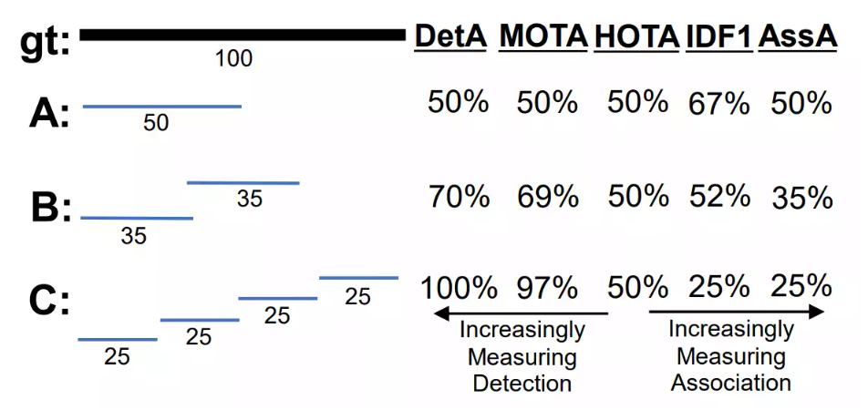
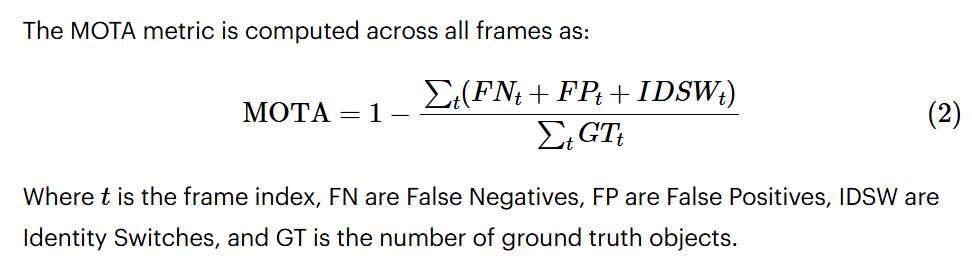
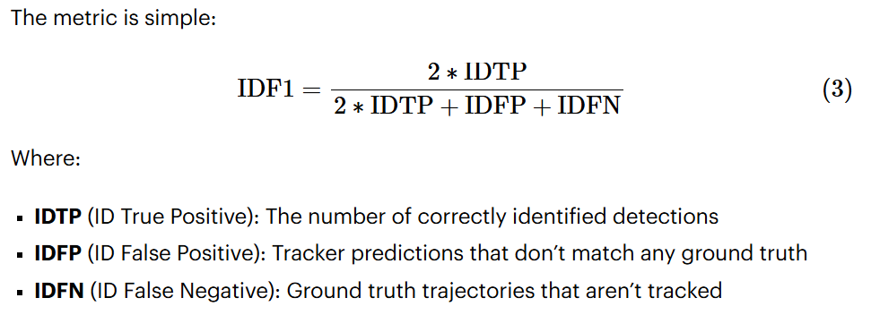
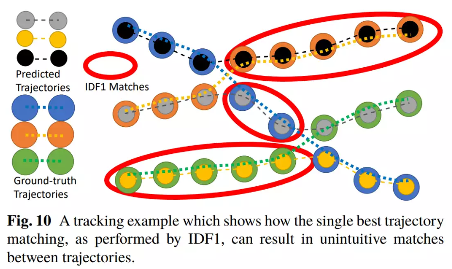
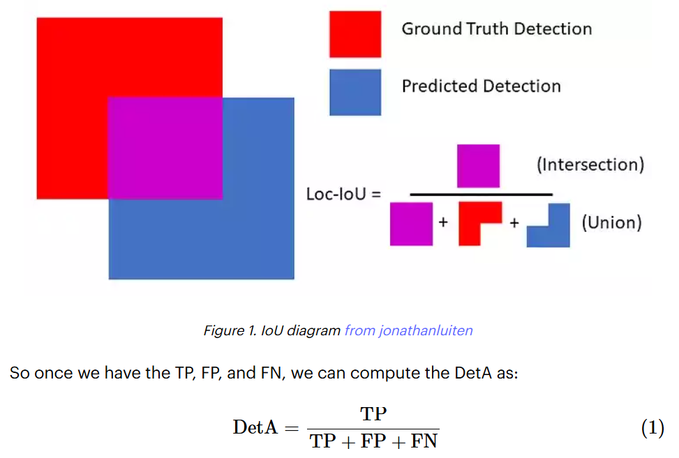
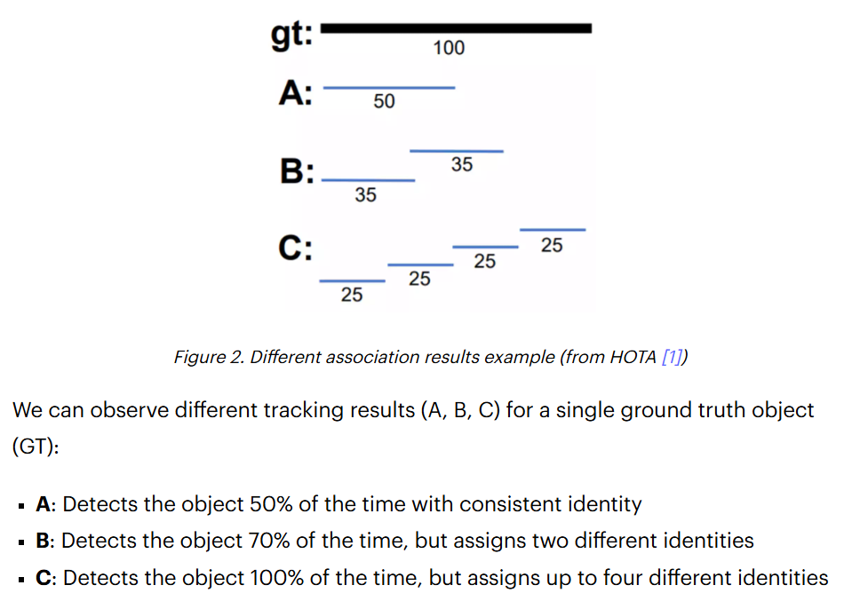
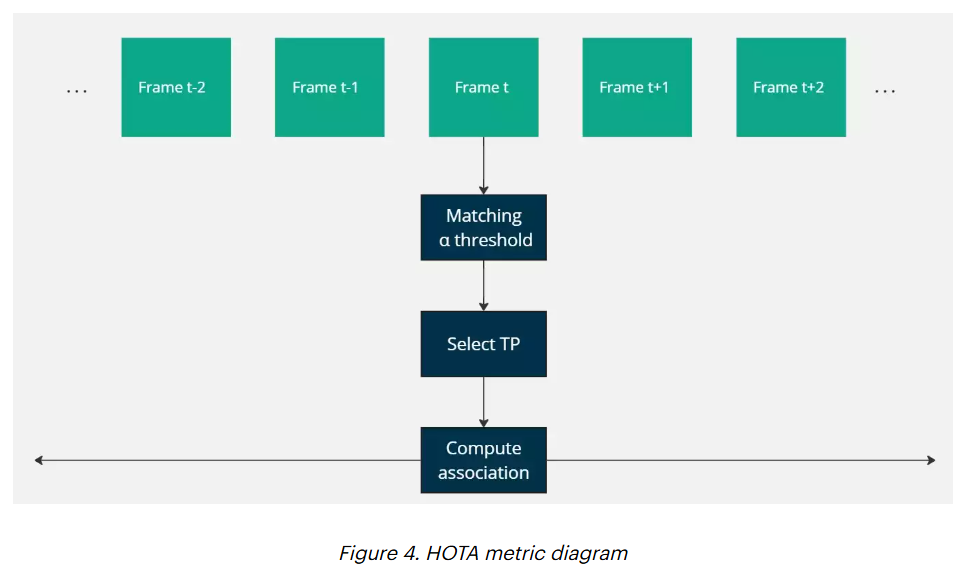
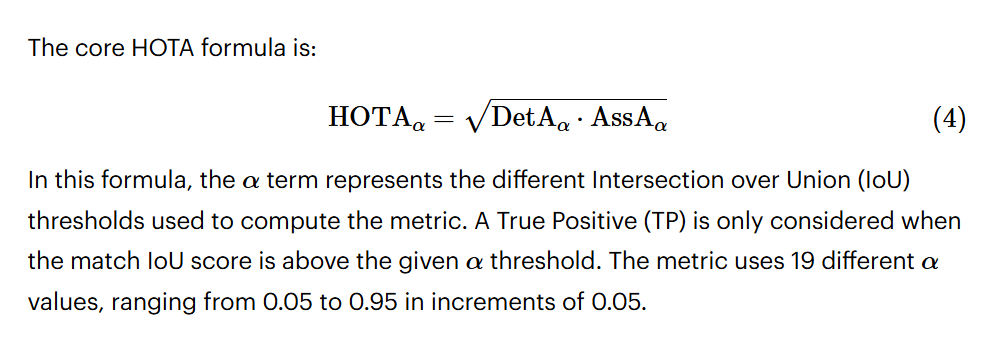

# Evaluation Metrics

[Reference](https://miguel-mendez-ai.com/2024/08/25/mot-tracking-metrics)

## 🔎 MOTA - Multi-Object Tracking Accuracy

MOTA introduces the concept of **identity tracking** to object detection metrics. 

It incorporates **identity switches** (IDSW), which occur when a single ground truth (GT) object is assigned to different track predictions over time.

- An IDSW is counted when a GT target  matches track *j* in the current frame but was matched to a different track *k* in the previous frame.

The computation of MOTA involves **temporal dependency**, penalizing **track assignment changes** between consecutive frames. 

While MOTA’s simplicity is appealing, it has some limitations:

1. It only considers the **previous frame** for IDSW, so each switch is penalized **only once**, regardless of how long the incorrect assignment persists.

2. It can be **dominated by FP and FN in crowded scenes**, making IDSW less impactful.

3. **IoU threshold is fixed** so more or less detection accuracy is not reflected on the metric

## 🎯 IDF1 - Identification F1-score

IDF1 addresses some of MOTA’s limitations by focusing on **how long the tracker correctly identifies an object**, rather than just counting errors. It’s based on the concept of **Identification Precision** (IDP) and **Identification Recall** (IDR).

It computes the assignment between prediction and ground truth objects **across the entire video**, rather than frame by frame.

Key advantages of IDF1:

1. It's more sensitive to **long-term tracking consistency**.

2. It balances precision and recall of **identity predictions**.

3. It's **less affected by the number of objects** in the scene than MOTA.

However, IDF1 also has limitations:

1. IDF1 can **decrease when improving detection**. Just avoiding FP can result in a better metric

2. **IoU threshold is fixed** so more or less detection accuracy is not reflected on the metric

## 🔎 HOTA - Higher-Order Tracking Accuracy

HOTA is a more recent metric designed to address the limitations of both MOTA and IDF1. 

It aims to provide a **balanced assessment of detection and association** performance. 

HOTA can be broken down into **DetA** (Detection Accuracy) and **AssA** (Association Accuracy), allowing separate analyses of these aspects.

 About DetA and AssA 

- **Detection Accuracy** (DetA) measures how well a tracker localizes **objects in each frame**, typically using Intersection over Union (IoU) thresholds. It essentially quantifies the **spatial accuracy of detections**.
- 

- **Association Accuracy** (AssA) evaluates how accurately a tracker maintains **object identities across frames**. It focuses on the **temporal consistency of ID assignments**, measuring how well the tracker links detections of the same object over time.
- 

 About Diagram 

HOTA uses **global alignment** (high-order association) between predicted and ground truth detections, similar to IDF1, but also incorporates **localization accuracy**. In other word, HOTA evaluates both the ability to detect objects accurately and to maintain correct associations over time.

HOTA drawbacks:

1. **Not Ideal for Online Tracking**: HOTA's association score depends on future associations across the entire video, making it less suitable for evaluating online tracking where future data isn't available.

2. **Doesn't Account for Fragmentation**: HOTA doesn't penalize fragmented tracking results, as it is designed to focus on long-term global tracking, which may not align with all application needs.

## 📊 Others

### Multi-Object Detection

- **MODA** - Multi-Object Detection Accuracy

- **MODP** - Multi-Object Detection Precision
