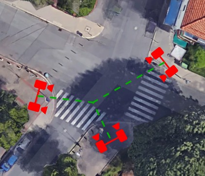

# Datasets

## 🛢️ Wildtrack

**Wildtrack** is a large-scale and high-resolution dataset.

It has been captured with **7 static cameras** in a public open area, and unscripted **dense groups of pedestrians** standing and walking. 

Together with the camera frames, we provide an accurate joint **(extrinsic and intrinsic) calibration**, as well as 7 series of **400 annotated frames** for detection at a rate of **2 frames per second**. 

This results in over **40 000 bounding boxes** delimiting every person present in the area of interest, for a total of more than **300 individuals**.

[Repo](https://github.com/dataset-ninja/wildtrack) | [Toolkit](https://github.com/Chavdarova/WILDTRACK-toolkit) | [Leaderboard](https://paperswithcode.com/sota/multi-object-tracking-on-wildtrack)

- **Download**: [Kaggle](https://www.kaggle.com/datasets/aryashah2k/large-scale-multicamera-detection-dataset) | [Supervisely](https://assets.supervisely.com/remote/eyJsaW5rIjogImZzOi8vYXNzZXRzLzM0OTJfV2lsZHRyYWNrL3dpbGR0cmFjay1EYXRhc2V0TmluamEudGFyIiwgInNpZyI6ICJISitvTzE5ME92ODM3NW9WRGFuOE4wUEU4SVJqUG1FLzVRSm9ZNDFhRmxzPSJ9) | [CVLab](http://documents.epfl.ch/groups/c/cv/cvlab-unit/www/data/Wildtrack/Wildtrack_dataset_full.zip)

- **Camera Setup**:

## 🗄️ MultiviewX

**MultiviewX** is a *synthetic* Multi-view pedestrian detection dataset. 

It is build using pedestrian models from [PersonX](https://github.com/sxzrt/Dissecting-Person-Re-ID-from-the-Viewpoint-of-Viewpoint), in Unity. 

This dataset covers a square of **16 m x 25 m**. The ground plane is quantized into a **640 x 1000 grid**. 

There are **6 cameras** with **overlapping field-of-view**, each of which outputs a **1080 x 1920 resolution** image. On average, any space will be covered by **4.41 cameras**.

[Toolkit](https://github.com/hou-yz/MultiviewX) | [Leaderboard](https://paperswithcode.com/sota/multiview-detection-on-multiviewx)

- **Download**: [dataset](https://1drv.ms/u/s!AtzsQybTubHfhYZ9Ghhahbp20OX9kA?e=Hm9Xdg)

- **Demo**:

## 🛢 i.c.sens

This dataset was acquired for the purpose of collaborative pedestrian tracking from multiple viewpoints. 

This dataset consists of **29 image sequences** which capture trajectories of pedestrians from **3 different viewpoints** with **3 stereo camera pairs**. 

Each captured image pair (left and right) has a **global timestamp**. The coressponding image sequences in different views have the same sequence number. 

The **identity number** of a pedestrian is unique and identical across viewpoints.

- **Download**: [dataset](https://service.tib.eu/ldmservice/vdataset/luh-multi-view-pedestrian-tracking)

- **Camera Setup**:

## ⛁ Others

- Multi-Camera Trajectory Forecasting ([paper](https://arxiv.org/abs/2005.00282) | [repo](https://github.com/olly-styles/Multi-Camera-Trajectory-Forecasting))

- Multi-camera Multiple-People Tracking ([project](https://iccv2021-mmp.github.io/subpage/dataset.html) | [repo](https://github.com/damo-cv/MMP_Track1_ICCV21))

- EPFL-RLC Multi-Camera Dataset ([project](https://www.epfl.ch/labs/cvlab/data/data-rlc/))

- (Game 3D) MTA Multi Camera Track Auto ([repo](https://github.com/schuar-iosb/mta-dataset))

