# OpenTraj

## Human Trajectory Prediction Dataset Benchmark

[Original Repo](https://github.com/crowdbotp/OpenTraj) | [My Fork](https://github.com/HariWu1995/BenTraj) (**clean code**)

We introduce existing datasets for Human Trajectory Prediction (HTP) task, and also provide tools to load, visualize and analyze datasets. 

So far multiple datasets are supported.

## Datasets

🗓️ Last checked @ **2025-03-18**

### Available Datasets

#### Fixed Background / Static Camera

<!--begin(table_main)-->
| Sample | Name | &nbsp;&nbsp;&nbsp;&nbsp;&nbsp;&nbsp;&nbsp;&nbsp;&nbsp;&nbsp;&nbsp;&nbsp;&nbsp;&nbsp;&nbsp;&nbsp;&nbsp;&nbsp;&nbsp;&nbsp;&nbsp;&nbsp;&nbsp;&nbsp;&nbsp;&nbsp;&nbsp;&nbsp;&nbsp;&nbsp;&nbsp;&nbsp;&nbsp;&nbsp;&nbsp;&nbsp;&nbsp;&nbsp;&nbsp;&nbsp;&nbsp;&nbsp;&nbsp;&nbsp;&nbsp;&nbsp;&nbsp;&nbsp;&nbsp;&nbsp;Description&nbsp;&nbsp;&nbsp;&nbsp;&nbsp;&nbsp;&nbsp;&nbsp;&nbsp;&nbsp;&nbsp;&nbsp;&nbsp;&nbsp;&nbsp;&nbsp;&nbsp;&nbsp;&nbsp;&nbsp;&nbsp;&nbsp;&nbsp;&nbsp;&nbsp;&nbsp;&nbsp;&nbsp;&nbsp;&nbsp;&nbsp;&nbsp;&nbsp;&nbsp;&nbsp;&nbsp;&nbsp;&nbsp;&nbsp;&nbsp;&nbsp;&nbsp;&nbsp;&nbsp;&nbsp;&nbsp;&nbsp;&nbsp;&nbsp;&nbsp; | Reference | 
|----|----|----|----|
| 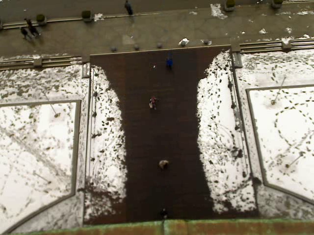 | [ETH](./OpenTraj/ETH) | 2 top view scenes containing walking pedestrians <code>#Traj:[Peds=750]</code> <code>Coord=world-2D</code> <code>FPS=2.5</code> | [website](http://www.vision.ee.ethz.ch/en/datasets/) [paper](https://ethz.ch/content/dam/ethz/special-interest/baug/igp/photogrammetry-remote-sensing-dam/documents/pdf/pellegrini09iccv.pdf) | 
| 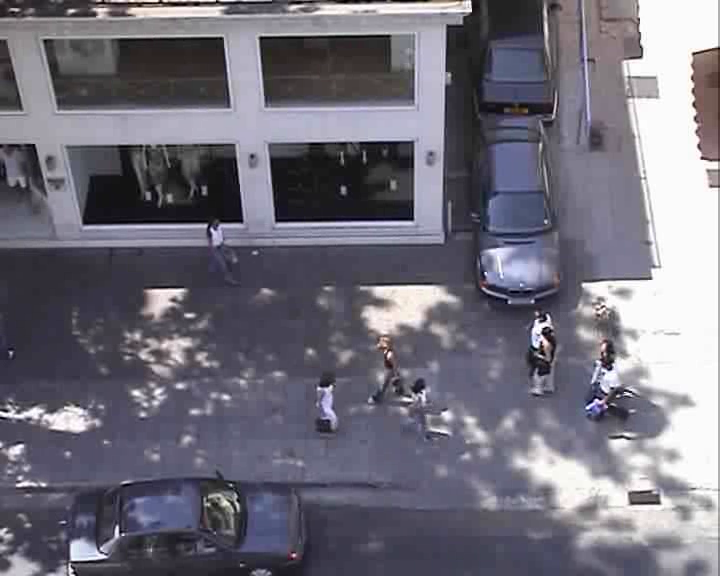 | [UCY](./OpenTraj/UCY) | 3 scenes (Zara/Arxiepiskopi/University). Zara and University close to top view. Arxiepiskopi more inclined. <code>#Traj:[Peds=786]</code> <code>Coord=world-2D</code> <code>FPS=2.5</code> | [website](https://graphics.cs.ucy.ac.cy/research/downloads/crowd-data) [paper](https://onlinelibrary.wiley.com/doi/full/10.1111/j.1467-8659.2007.01089.x) | 
| 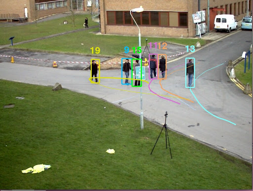 | [PETS 2009](./OpenTraj/PETS-2009) | different crowd activities <code>#Traj:[?]</code> <code>Coord=image-2D</code> <code>FPS=7</code> | [website](http://www.cvg.reading.ac.uk/PETS2009/data.html) [paper](https://projet.liris.cnrs.fr/imagine/pub/proceedings/AVSS-2010/data/4264a143.pdf) | 
| 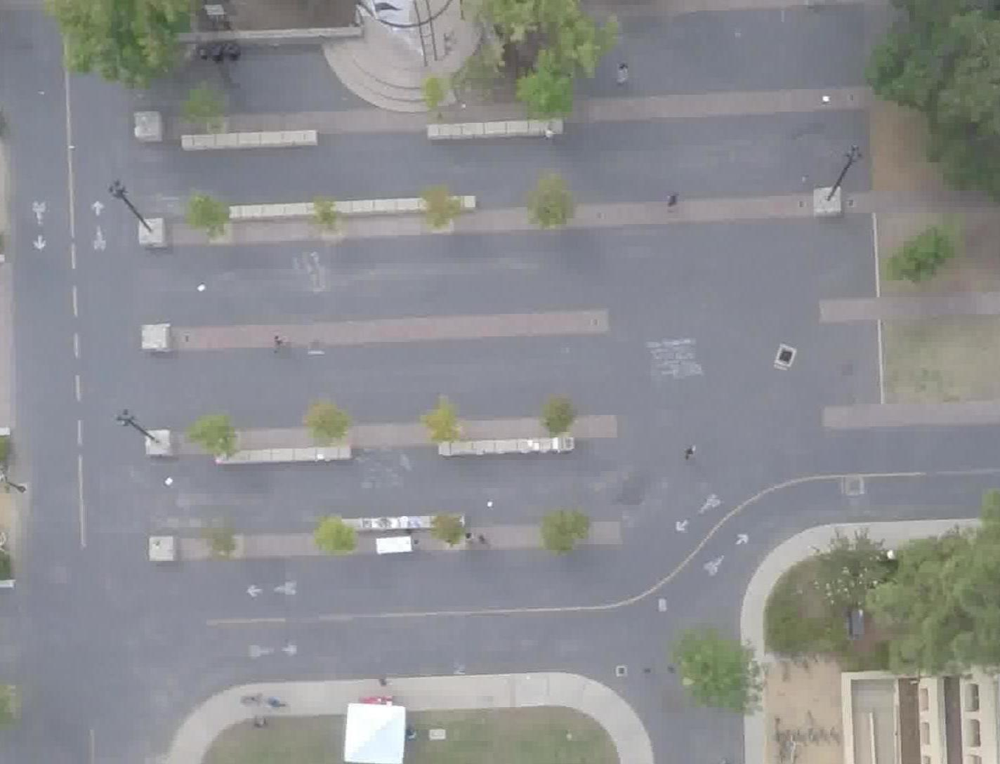 | [SDD](./OpenTraj/SDD) | 8 top view scenes recorded by drone contains various types of agents <code>#Traj:[Bikes=4210 Peds=5232 Skates=292 Carts=174 Cars=316 Buss=76 Total=10,300]</code> <code>Coord=image-2D</code> <code>FPS=30</code> | [website](http://cvgl.stanford.edu/projects/uav_data) [paper](http://svl.stanford.edu/assets/papers/ECCV16social.pdf) [dropbox](https://www.dropbox.com/s/v9jvt4ln7t42m6m/StanfordDroneDataset.zip) | 
|  | [GC](./OpenTraj/GC) | Grand Central Train Station Dataset: 1 scene of 33:20 minutes of crowd trajectories <code>#Traj:[Peds=12,684]</code> <code>Coord=image-2D</code> <code>FPS=25</code> | [dropbox](https://www.dropbox.com/s/7y90xsxq0l0yv8d/cvpr2015_pedestrianWalkingPathDataset.rar) [paper](http://openaccess.thecvf.com/content_cvpr_2015/html/Yi_Understanding_Pedestrian_Behaviors_2015_CVPR_paper.html) | 
| 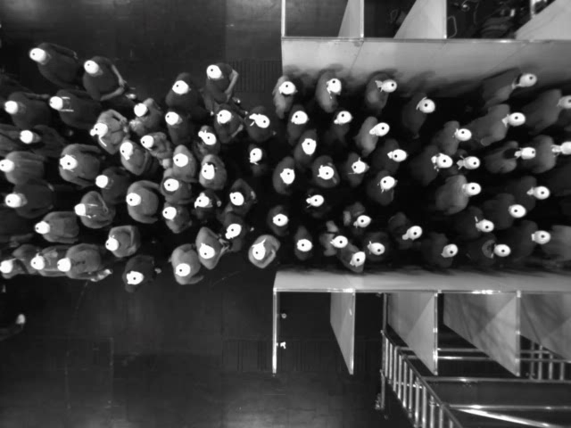 | [HERMES](./OpenTraj/HERMES) | Controlled Experiments of Pedestrian Dynamics (Unidirectional and bidirectional flows) <code>#Traj:[?]</code> <code>Coord=world-2D</code> <code>FPS=16</code> | [website](https://www.fz-juelich.de/ias/ias-7/EN/AboutUs/Projects/Hermes/_node.html) [data](https://www.fz-juelich.de/ias/ias-7/EN/Research/Pedestrian_Dynamics-Empiricism/_node.html) | 
| 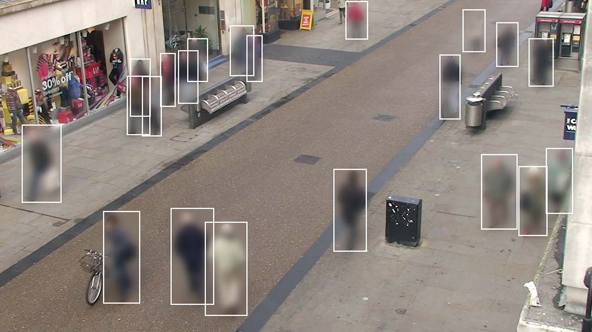 | [Town Center](./OpenTraj/Town-Center) | CCTV video of pedestrians in a busy downtown area in Oxford <code>#Traj:[peds=2,200]</code> <code>Coord=0</code> <code>FPS=0</code> | [website](https://megapixels.cc/datasets/oxford_town_centre/) [Kaggle](https://www.kaggle.com/datasets/almightyj/oxford-town-centre/data) | 
| 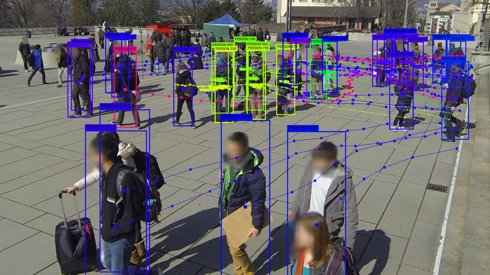 | [Wildtrack](./OpenTraj/Wildtrack) | Surveillance video dataset of students recorded outside the ETH university main building in Zurich. <code>#Traj:[peds=1,200]</code> | [website](https://megapixels.cc/wildtrack/) | 
| 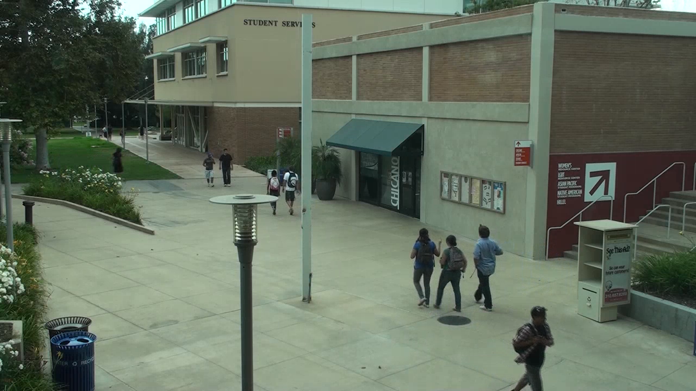 | [VIRAT](./OpenTraj/VIRAT) | Natural scenes showing people performing normal actions <code>#Traj:[?]</code> <code>Coord=0</code> <code>FPS=0</code> | [website](http://viratdata.org/) [data](https://data.kitware.com/#collection/56f56db28d777f753209ba9f/folder/56f57e748d777f753209bed7) | 
| 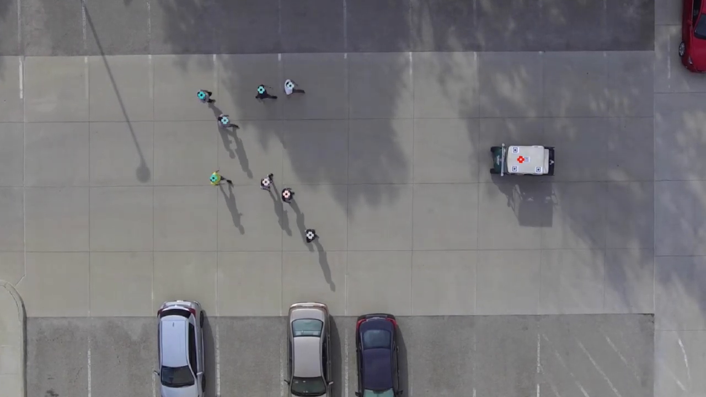 | [CITR](./OpenTraj/CITR) | Fundamental Vehicle-Crowd Interaction scenarios in controlled experiments <code>#Traj:[Peds=340]</code> <code>Coord=world-2D</code> <code>FPS=29.97</code> | [github](https://github.com/dongfang-steven-yang/vci-dataset-dut) [paper](https://arxiv.org/pdf/1902.00487.pdf) | 

<!--end(table_main)-->

#### Moving Background / Camera

<!--begin(table_main)-->
| Sample | Name | &nbsp;&nbsp;&nbsp;&nbsp;&nbsp;&nbsp;&nbsp;&nbsp;&nbsp;&nbsp;&nbsp;&nbsp;&nbsp;&nbsp;&nbsp;&nbsp;&nbsp;&nbsp;&nbsp;&nbsp;&nbsp;&nbsp;&nbsp;&nbsp;&nbsp;&nbsp;&nbsp;&nbsp;&nbsp;&nbsp;&nbsp;&nbsp;&nbsp;&nbsp;&nbsp;&nbsp;&nbsp;&nbsp;&nbsp;&nbsp;&nbsp;&nbsp;&nbsp;&nbsp;&nbsp;&nbsp;&nbsp;&nbsp;&nbsp;&nbsp;Description&nbsp;&nbsp;&nbsp;&nbsp;&nbsp;&nbsp;&nbsp;&nbsp;&nbsp;&nbsp;&nbsp;&nbsp;&nbsp;&nbsp;&nbsp;&nbsp;&nbsp;&nbsp;&nbsp;&nbsp;&nbsp;&nbsp;&nbsp;&nbsp;&nbsp;&nbsp;&nbsp;&nbsp;&nbsp;&nbsp;&nbsp;&nbsp;&nbsp;&nbsp;&nbsp;&nbsp;&nbsp;&nbsp;&nbsp;&nbsp;&nbsp;&nbsp;&nbsp;&nbsp;&nbsp;&nbsp;&nbsp;&nbsp;&nbsp;&nbsp; | Reference | 
|----|----|----|----|
| 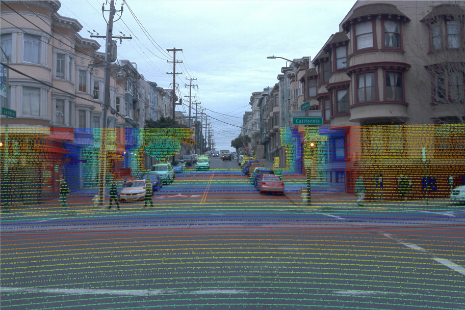 | [Waymo](./OpenTraj/Waymo) | High-resolution sensor data collected by Waymo self-driving cars <code>#Traj:[?]</code> <code>Coord=2D and 3D</code> <code>FPS=?</code> | [website](https://waymo.com/open/) [github](https://github.com/waymo-research/waymo-open-dataset) | 
| 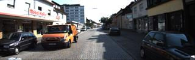 | [KITTI](./OpenTraj/KITTI) | 6 hours of traffic scenarios. various sensors <code>#Traj:[?]</code> <code>Coord=image-3D + Calib</code> <code>FPS=10</code> |  [website](http://www.cvlibs.net/datasets/kitti/) | 
| 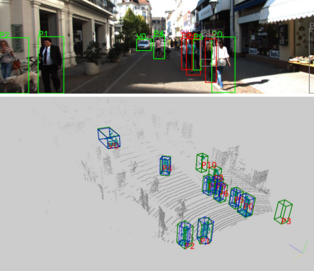 | [nuScenes](./OpenTraj/NuScenes) | Large-scale Autonomous Driving dataset <code>#Traj:[peds=222,164 vehicles=662,856]</code> <code>Coord=World + 3D Range Data</code> <code>FPS=2</code> | [website](www.nuscences.org) | 
| 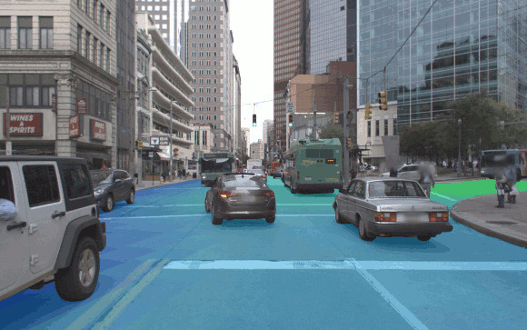 | [Argoverse](./OpenTraj/Argoverse) | 320 hours of Self-driving dataset <code>#Traj:[objects=11,052]</code> <code>Coord=3D</code> <code>FPS=10</code> | [website](https://www.argoverse.org) | 

<!--end(table_main)-->

### Unsuitable Datasets

Due to sensory data or vehicle tracking.

<!--begin(table_main)-->
| Sample | Name | &nbsp;&nbsp;&nbsp;&nbsp;&nbsp;&nbsp;&nbsp;&nbsp;&nbsp;&nbsp;&nbsp;&nbsp;&nbsp;&nbsp;&nbsp;&nbsp;&nbsp;&nbsp;&nbsp;&nbsp;&nbsp;&nbsp;&nbsp;&nbsp;&nbsp;&nbsp;&nbsp;&nbsp;&nbsp;&nbsp;&nbsp;&nbsp;&nbsp;&nbsp;&nbsp;&nbsp;&nbsp;&nbsp;&nbsp;&nbsp;&nbsp;&nbsp;&nbsp;&nbsp;&nbsp;&nbsp;&nbsp;&nbsp;&nbsp;&nbsp;Description&nbsp;&nbsp;&nbsp;&nbsp;&nbsp;&nbsp;&nbsp;&nbsp;&nbsp;&nbsp;&nbsp;&nbsp;&nbsp;&nbsp;&nbsp;&nbsp;&nbsp;&nbsp;&nbsp;&nbsp;&nbsp;&nbsp;&nbsp;&nbsp;&nbsp;&nbsp;&nbsp;&nbsp;&nbsp;&nbsp;&nbsp;&nbsp;&nbsp;&nbsp;&nbsp;&nbsp;&nbsp;&nbsp;&nbsp;&nbsp;&nbsp;&nbsp;&nbsp;&nbsp;&nbsp;&nbsp;&nbsp;&nbsp;&nbsp;&nbsp; | Reference | 
|----|----|----|----|
| 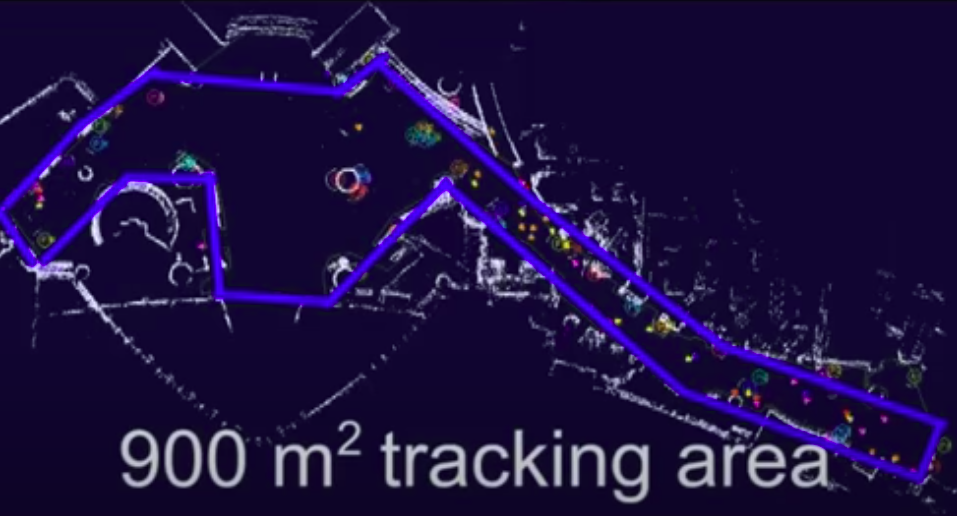 | [ATC](./OpenTraj/ATC) | 92 days of pedestrian trajectories in a shopping center in Osaka, Japan <code>#Traj:[?]</code> <code>Coord=world-2D + Range data</code> | [website](https://irc.atr.jp/crest2010_HRI/ATC_dataset) | 
| 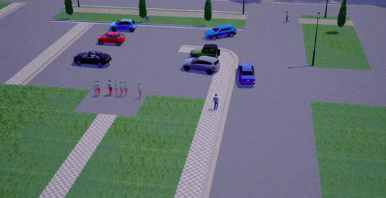 | [Forking Paths Garden](./OpenTraj/Forking-Paths-Garden) | **Multi-modal** _Synthetic_ dataset, created in [CARLA](https://carla.org) (3D simulator) based on real world trajectory data, extrapolated by human annotators <code>#Traj:[?]</code> | [website](https://next.cs.cmu.edu/multiverse/index.html) [github](https://github.com/JunweiLiang/Multiverse) [paper](https://arxiv.org/abs/1912.06445) | 
| 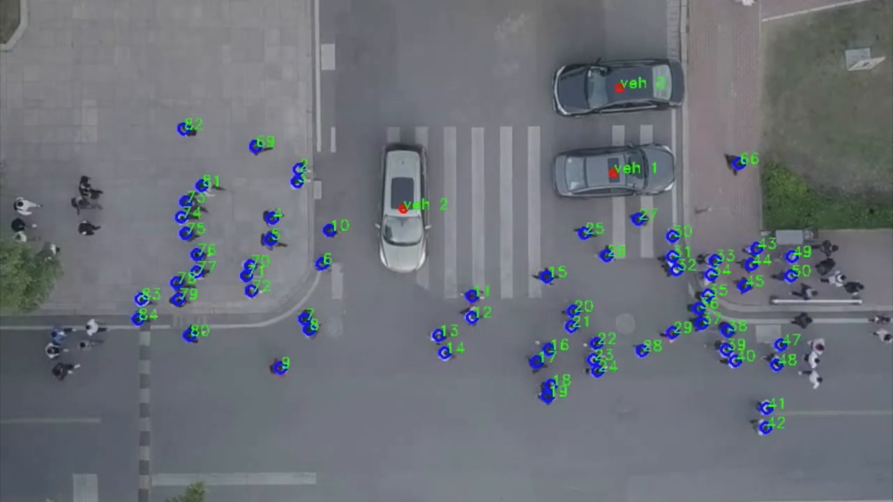 | [DUT](./OpenTraj/DUT) | Natural Vehicle-Crowd Interactions in crowded university campus <code>#Traj:[Peds=1,739 vehicles=123 Total=1,862]</code> <code>Coord=world-2D</code> <code>FPS=23.98</code> | [github](https://github.com/dongfang-steven-yang/vci-dataset-dut) [paper](https://arxiv.org/pdf/1902.00487.pdf) | 
| 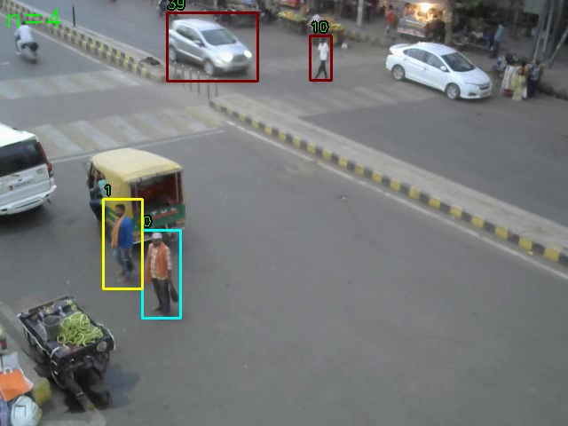 | [TRAF](./OpenTraj/TRAF) | small dataset of dense and heterogeneous traffic videos in India (22 footages) <code>#Traj:[Cars=33 Bikes=20 Peds=11]</code> <code>Coord=image-2D</code> <code>FPS=10</code> | [website](https://gamma.umd.edu/researchdirections/autonomousdriving/trafdataset/) [GDrive](https://drive.google.com/drive/folders/1zKaeboslkqoLdTJbRMyQ0Y9JL3007LRr) [paper](https://arxiv.org/pdf/1812.04767.pdf) | 
| 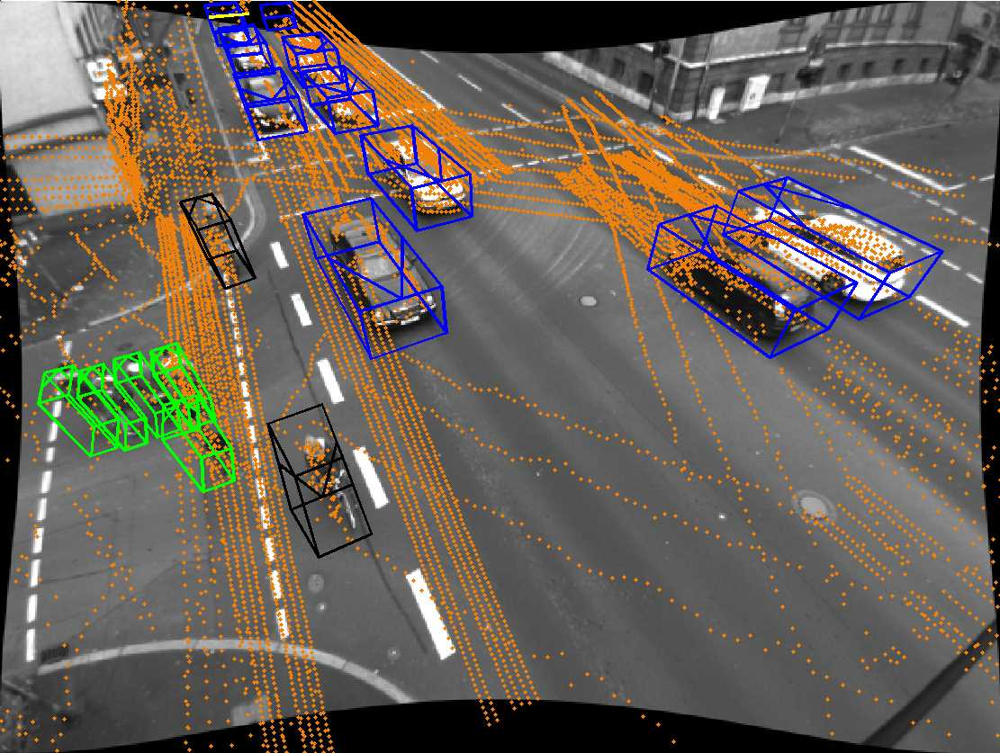 | [Ko-PER](./OpenTraj/Ko-PER) | Trajectories of People and vehicles at Urban Intersections (Laserscanner + Video) <code>#Traj:[peds=350]</code> <code>Coord=world-2D</code> | [paper](https://www.uni-ulm.de/fileadmin/website_uni_ulm/iui.inst.110/Bilder/Forschung/Datensaetze/20141010_DatasetDocumentation.pdf) [website](www.uni-ulm.de/in/mrm/forschung/datensaetze.html) | 

<!--end(table_main)-->

### Unavailable Datasets

Due to out-of-date or un-commercial.

<!--begin(table_main)-->
| Sample | Name | &nbsp;&nbsp;&nbsp;&nbsp;&nbsp;&nbsp;&nbsp;&nbsp;&nbsp;&nbsp;&nbsp;&nbsp;&nbsp;&nbsp;&nbsp;&nbsp;&nbsp;&nbsp;&nbsp;&nbsp;&nbsp;&nbsp;&nbsp;&nbsp;&nbsp;&nbsp;&nbsp;&nbsp;&nbsp;&nbsp;&nbsp;&nbsp;&nbsp;&nbsp;&nbsp;&nbsp;&nbsp;&nbsp;&nbsp;&nbsp;&nbsp;&nbsp;&nbsp;&nbsp;&nbsp;&nbsp;&nbsp;&nbsp;&nbsp;&nbsp;Description&nbsp;&nbsp;&nbsp;&nbsp;&nbsp;&nbsp;&nbsp;&nbsp;&nbsp;&nbsp;&nbsp;&nbsp;&nbsp;&nbsp;&nbsp;&nbsp;&nbsp;&nbsp;&nbsp;&nbsp;&nbsp;&nbsp;&nbsp;&nbsp;&nbsp;&nbsp;&nbsp;&nbsp;&nbsp;&nbsp;&nbsp;&nbsp;&nbsp;&nbsp;&nbsp;&nbsp;&nbsp;&nbsp;&nbsp;&nbsp;&nbsp;&nbsp;&nbsp;&nbsp;&nbsp;&nbsp;&nbsp;&nbsp;&nbsp;&nbsp; | Reference | 
|----|----|----|----|
| 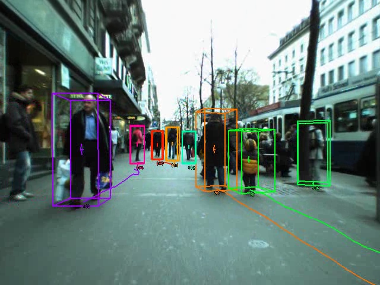 | [ETH-Person](./OpenTraj/ETH-Person) | Multi-Person Data Collected from Mobile Platforms | [website](https://data.vision.ee.ethz.ch/cvl/aess/) | 
| 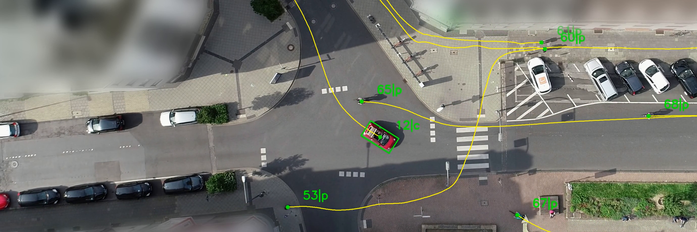 | [inD](./OpenTraj/InD) | Naturalistic Trajectories of Vehicles and Vulnerable Road Users Recorded at German Intersections <code>#Traj:[Total=11,500]</code> <code>Coord=world-2D</code> <code>FPS=25</code> | [website](https://www.ind-dataset.com/) [paper](https://arxiv.org/pdf/1911.07602.pdf) | 
| 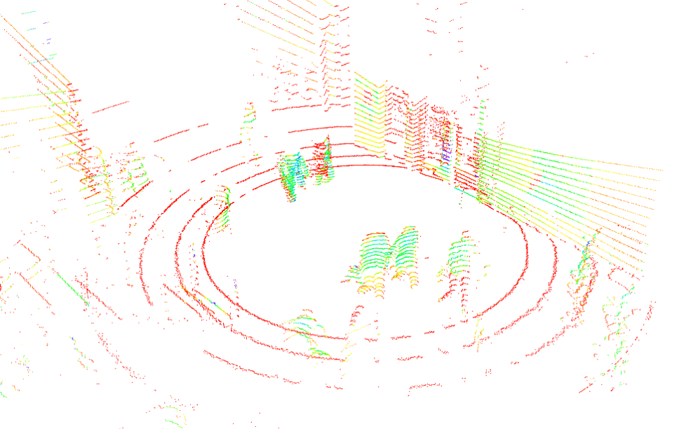 | [L-CAS](./OpenTraj/L-CAS) | Multisensor People Dataset Collected by a Pioneer 3-AT robot <code>#Traj:[?]</code> <code>Coord=0</code> <code>FPS=0</code> | [website](https://lcas.lincoln.ac.uk/wp/research/data-sets-software/l-cas-multisensor-people-dataset/) [GDrive](https://drive.google.com/drive/folders/1CPV9XeJsZzvtTxPQ9u1ppLGs_29e-XdQ) | 
| 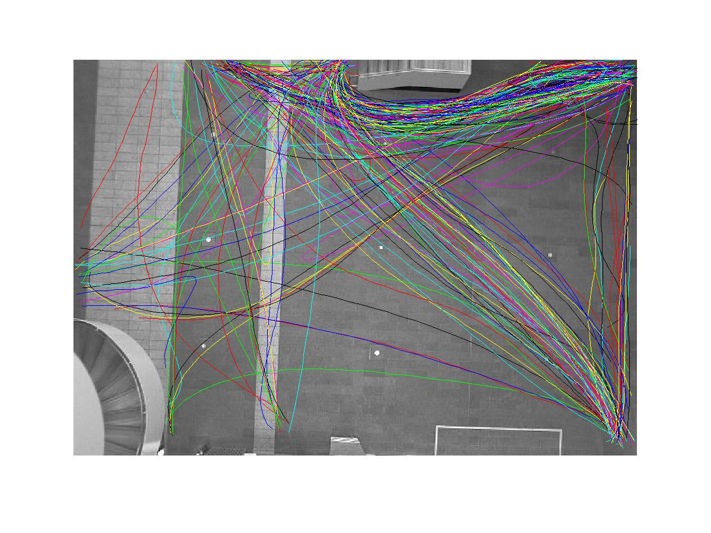 | [Edinburgh](./OpenTraj/Edinburgh) | People walking through the Informatics Forum (University of Edinburgh) <code>#Traj:[ped=+92,000]</code> <code>FPS=0</code> | [website](http://homepages.inf.ed.ac.uk/rbf/FORUMTRACKING/) | 
| 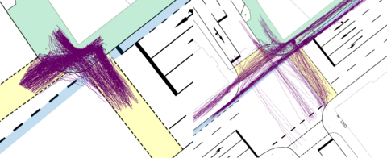 | [VRU](./OpenTraj/VRU) | consists of pedestrian and cyclist trajectories, recorded at an urban intersection using cameras and LiDARs <code>#Traj:[peds=1068 Bikes=464]</code> <code>Coord=World (Meter)</code> <code>FPS=25</code> | [website](https://www.th-ab.de/ueber-uns/organisation/labor/kooperative-automatisierte-verkehrssysteme/trajectory-dataset) | 
|  | [City Scapes](./OpenTraj/City-Scapes) | 25,000 annotated images (Semantic/ Instance-wise/ Dense pixel annotations) <code>#Traj:[?]</code> | [website](https://www.cityscapes-dataset.com/dataset-overview/) | 

<!--end(table_main)-->

<!--
#### Other Trajectory Datasets
- [NGSim](https://catalog.data.gov/dataset/next-generation-simulation-ngsim-vehicle-trajectories)
- [Daimler](http://www.gavrila.net/Datasets/Daimler_Pedestrian_Benchmark_D/daimler_pedestrian_benchmark_d.html)
- [Cyclist](No Link)
- [highD](No Link)
-->

## Human Trajectory Prediction Benchmarks
- [Trajnet](http://trajnet.stanford.edu/): Trajectory Forecasting Challenge
- [Trajnet++](https://www.aicrowd.com/challenges/trajnet-a-trajectory-forecasting-challenge): Trajectory Forecasting Challenge
- [MOT-Challenge](https://motchallenge.net): Multiple Object Tracking Benchmark
- [JackRabbot](https://jrdb.stanford.edu/): Detection And Tracking Dataset and Benchmark

## Toolkit
`To download the toolkit, separately in a zip file click:` [here](https://downgit.github.io/#/home?url=https://github.com/amiryanj/OpenTraj/tree/master/toolkit)


### 1. Benchmarks
Using python files in [indicators](libs/OpenTraj/indicators) directory, you can generate the results of each of the indicators presented in the article. For more information about each of the scripts check the information in [libs/OpenTraj](libs/OpenTraj).

To benchmarking all indicators, run
```bash
python -m libs.OpenTraj.benchmark
```
Results are stored in **[temp/benchmark](temp/benchmark)**.

### 2. Loaders
Using python files in [loaders](libs/OpenTraj/loaders) directory, you can load a dataset into a dataset object, which uses Pandas data frames to store the data. It would be super easy to retrieve the trajectories, using different queries (by agent_id, timestamp, ...).

### 3. Visualization
A simple script [ui_pyqt.py](libs/OpenTraj/ui/ui_pyqt.py) can be used to visualize a given dataset:

<p align='center'>
  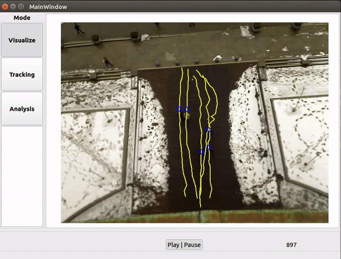
</p>

Some other visualization scripts are [ui_cv.py](libs/OpenTraj/ui/ui_cv.py) and [ui_dash.py](libs/OpenTraj/ui/ui_dash.py).


## Metrics

### Notation
- T<sub>obs</sub> : observation period
- T<sub>pred</sub> : prediction period

### 1. ADE (T<sub>obs</sub>, T<sub>pred</sub>)
**Average Displacement Error** (ADE), also called **Mean Euclidean Distance** (MED), measures the averages Euclidean distances between points of the predicted trajectory and the ground truth that have the same temporal distance from their respective start points.

### 2. FDE (T<sub>obs</sub>, T<sub>pred</sub>)
**Final Displacement Error** (FDE) measures the distance between final predicted position and the ground truth position at the corresponding time point.

## Algorithms (SOTA)
\* The numbers are derived from papers.
- [ ] setup benchmarking 
- [ ] update top 20 papers
-->

## References

### Main References:
- Who are you with and Where are you going? (Social Force), Yamaguchi et al. CVPR 2011. [paper]()
- Social LSTM: Human trajectory prediction in crowded spaces, Alahi et al. CVPR 2016. [paepr]()
- Learning social etiquette: Human trajectory understanding in crowded scenes, Robicquet et al. ECCV 2016. [paper](https://infoscience.epfl.ch/record/230262/files/ECCV16social.pdf) 
- Social GAN: Socially Acceptable Trajectories with Generative Adversarial Networks, Gupta et al. CVPR 2018. [paper]()
- Social Ways: Learning Multi-Modal Distributions of Pedestrian Trajectories with GANs, Amirian et al. CVPR 2019. [paper](), [code]()

### Other References: 
An *awesome* list of trajectory prediction references can be found [here](https://github.com/jiachenli94/Awesome-Interaction-aware-Trajectory-Prediction)

<!--
- Desire: Distant future prediction in dynamic scenes with interacting agents, Lee et al. CVPR 2017. [paper](http://openaccess.thecvf.com/content_cvpr_2017/papers/Lee_DESIRE_Distant_Future_CVPR_2017_paper.pdf)
- Sophie: An attentive gan for predicting paths compliant to social and physical constraints, Sadeghian et al. CVPR 2019. [paper](https://arxiv.org/pdf/1806.01482.pdf)
- [MATF (Multi-Agent Tensor Fusion)](http://openaccess.thecvf.com/content_CVPR_2019/papers/Zhao_Multi-Agent_Tensor_Fusion_for_Contextual_Trajectory_Prediction_CVPR_2019_paper.pdf)
- [Best of Many](http://openaccess.thecvf.com/content_cvpr_2018/papers/Bhattacharyya_Accurate_and_Diverse_CVPR_2018_paper.pdf)
-->

<!--
#### (B) Surveys:
&ast; ordered by time
- A Survey on Path Prediction Techniques for Vulnerable Road Users: From Traditional to Deep-Learning Approaches, ITSC 2019. [paper](https://ieeexplore.ieee.org/abstract/document/8917053)
- Human Motion Trajectory Prediction: A Survey, IJRR 2019 [arxiv](https://arxiv.org/abs/1905.06113)
- Autonomous vehicles that interact with pedestrians: A survey of theory and practice, ITS 2019. [arxiv](https://arxiv.org/abs/1805.11773)
- A literature review on the prediction of pedestrian behavior in urban scenarios, ITSC 2018. [paper](https://ieeexplore.ieee.org/abstract/document/8569415)
- Survey on Vision-Based Path Prediction, DAPI 2018. [arxiv](https://arxiv.org/abs/1811.00233)
- Trajectory data mining: an overview, TIST 2015. [paper](https://www.microsoft.com/en-us/research/wp-content/uploads/2015/09/TrajectoryDataMining-tist-yuzheng.pdf)
- A survey on motion prediction and risk assessment for intelligent vehicles, ROBOMECH 2014. [paper](https://core.ac.uk/download/pdf/81530180.pdf)
-->

## Contributions
Have any idea to improve the code? Fork the project, update it and submit a merge request. 
- Feel free to open new issues.

If you find this work useful in your research, then please cite:
```
@inproceedings{amirian2020opentraj,
      title={OpenTraj: Assessing Prediction Complexity in Human Trajectories Datasets}, 
      author={Javad Amirian and Bingqing Zhang and Francisco Valente Castro and Juan Jose Baldelomar and Jean-Bernard Hayet and Julien Pettre},
      booktitle={Asian Conference on Computer Vision (ACCV)},
      number={CONF},      
      year={2020},
      organization={Springer}
}
```
