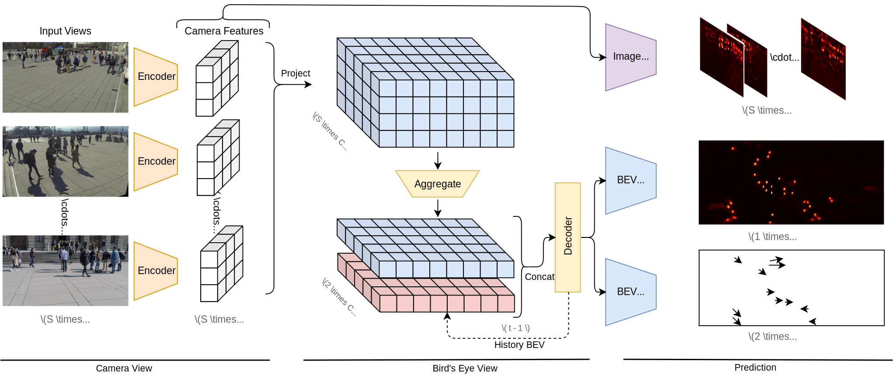

# TrackTacular :octopus:

**Lifting Multi-View Detection and Tracking to the Bird’s Eye View**

[Torben Teepe](https://github.com/tteepe),
[Philipp Wolters](https://github.com/phi-wol),
[Johannes Gilg](https://github.com/Blueblue4),
[Fabian Herzog](https://github.com/fubel),
Gerhard Rigoll

[](https://arxiv.org/abs/2403.12573)

[](https://paperswithcode.com/sota/multi-object-tracking-on-wildtrack?p=lifting-multi-view-detection-and-tracking-to)
[](https://paperswithcode.com/sota/multi-object-tracking-on-multiviewx?p=lifting-multi-view-detection-and-tracking-to)
[](https://paperswithcode.com/sota/multiview-detection-on-multiviewx?p=lifting-multi-view-detection-and-tracking-to)

> [!TIP]
> This work is an extension of your previous work [EarlyBird  🦅](https://github.com/tteepe/EarlyBird).
> Feel free to check it out and extend our multi-view object detection and tracking pipeline on other datasets!



## Environment
1. Install [PyTorch](https://pytorch.org/get-started/locally/) with CUDA support
    ```shell
   pip install torch torchvision --index-url https://download.pytorch.org/whl/cu118
   ```

2. Install remaining dependencies
   ```shell
   pip install -r requirements.txt
   ```

<details>
<summary>MMCV</summary>

- Original: Install [mmcv](https://mmcv.readthedocs.io/en/latest/get_started/installation.html#install-with-pip) with CUDA support
   ```shell
   pip install mmcv==2.0.0 -f https://download.openmmlab.com/mmcv/dist/cu118/torch2.1/index.html
   ```

- Windows: Torch 2.5.1 + CUDA 12.4
   ```shell
   pip install mmcv-full==1.7.1 -f https://download.openmmlab.com/mmcv/dist/12.4/2.5.1/index.html
   ```

- Kaggle: read this [notebook](https://www.kaggle.com/code/mrriandmstique/mmcv-builder)
</details>

## Training
Requirement: GPU > 15 Gb

Single-GPU Training:
```shell
python -m libs.TrackTacular.world_track fit \
       -c libs/TrackTacular/configs/trainer_fit.yml \
       -c libs/TrackTacular/configs/dataset_{multiviewx,wildtrack,synthehicle}.yml \
       -c libs/TrackTacular/configs/model_{mvdet,segnet,liftnet,bevformer}.yml
```

Distributed Training:
```shell
python -m libs.TrackTacular.world_track fit \
       -c libs/TrackTacular/configs/trainer_fit.yml \
       -c libs/TrackTacular/configs/trainer_dist.yml \
       -c libs/TrackTacular/configs/dataset_{multiviewx,wildtrack,synthehicle}.yml \
       -c libs/TrackTacular/configs/model_{mvdet,segnet,liftnet,bevformer}.yml
```

Training on [Kaggle](https://www.kaggle.com/code/mrriandmstique/tracktacular)

## Testing
```shell
python -m libs.TrackTacular.world_track test \
        -c "./checkpoints/TrackTacular/mvx_liftnet/config.yaml" \
    --ckpt "./checkpoints/TrackTacular/mvx_liftnet/model.ckpt" \
    --data.batch_size 1
```

## Acknowledgement
- [Simple-BEV](https://simple-bev.github.io): Adam W. Harley
- [MVDeTr](https://github.com/hou-yz/MVDeTr): Yunzhong Hou

## Citation
```bibtex
@article{teepe2023lifting,
      title={Lifting Multi-View Detection and Tracking to the Bird's Eye View}, 
      author={Torben Teepe and Philipp Wolters and Johannes Gilg and Fabian Herzog and Gerhard Rigoll},
      year={2024},
      eprint={2403.12573},
      archivePrefix={arXiv},
      primaryClass={cs.CV}
}
```
