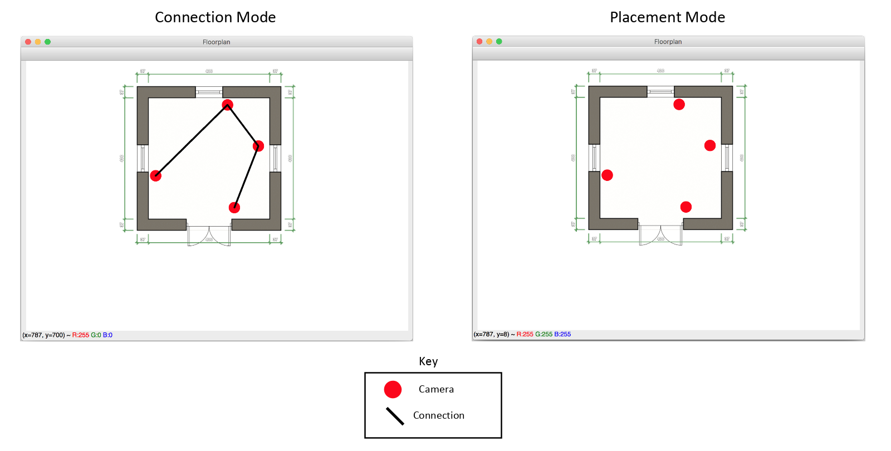

# Camera

## 🧬 Fundamentals

- [Camera Conventions](https://camtools.readthedocs.io/en/stable/camera.html)

- Camera Projections - [Extrinsic](https://ksimek.github.io/2012/08/22/extrinsic/) and [Intrinsic](https://ksimek.github.io/2013/08/13/intrinsic/)

- [Camera FoV](https://commonlands.com/pages/camera-field-of-view-calculator)

## 🦾 Features 🦿

✅ **Camera-Mesh Allocation**: Multi-Camera Allocation with Overlapped Field-of-View - [Script](../../scripts/camera_mesh_allocation.py)

⬜ **Camera Calibration**: Camera Self-Location in a Multi-Camera Mesh-System

⬜ **Camera Projection**: Camera (Local) Pixel to Mesh (Global) Coordinate

## 🔎 Case studies
    
- [Multi-Camera Single-Object Tracking](https://github.com/arvganesh/Multi-Camera-Object-Tracking)

- [Multi-Camera Live-Object Tracking](https://github.com/LeonLok/Multi-Camera-Live-Object-Tracking) (Traffic / Vehicle)

- [Multi-Camera Multi-Target Tracking](https://github.com/nolanzzz/mtmct) (Game 3D)

## 🧮 Frameworks / Libraries:

- [CamTools](https://github.com/yxlao/camtools)

- [Open3D](https://github.com/isl-org/Open3D) - [Visualization](https://www.open3d.org/docs/release/tutorial/visualization/visualization.html)

- [Ultralytics](https://github.com/ultralytics/ultralytics)

## 🔬 Algorithms:

- **DeepSORT**: Simple Online and Realtime Tracking with a Deep Association Metric ([paper](https://arxiv.org/abs/1703.07402) | [code](https://github.com/nwojke/deep_sort) | [code-realtime](https://github.com/levan92/deep_sort_realtime))

- **ADA-Track**: End-to-End Multi-Camera 3D Multi-Object Tracking ([paper](https://arxiv.org/pdf/2405.08909v1) | [code](https://github.com/dsx0511/ADA-Track))

